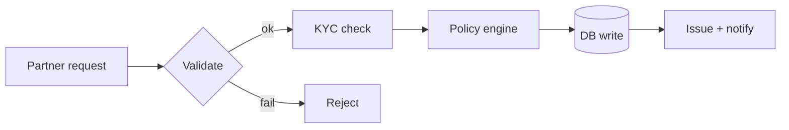

When I joined the issuance flow at Bajaj Finserv Health, we topped out around
**1,200 policies/hour** and fell over whenever a partner ran a campaign. A year
later the same pipeline did **5,000+/hour at 99%+ uptime** — and almost none of
that came from the "clever" ideas.

## The shape of the problem

Issuance looked like a tidy request/response, but underneath it was a chain of
synchronous calls to partners, KYC, and a policy engine. One slow hop stalled
everything behind it.



The instinct is to reach for caching or a rewrite. The actual wins were duller.

## What actually moved the needle

1. **Make the slow hops async.** The KYC and notify steps didn't need to block
   issuance — an event-driven layer let the request return as soon as the policy
   was committed.
2. **Stop hammering the database.** A single N+1 in the policy lookup was ~40% of
   our query volume. Batching it was a one-day fix.
3. **Backpressure over heroics.** KEDA autoscaling on queue depth meant campaigns
   scaled the workers instead of the on-call engineer's blood pressure.

```go
// batch the lookups instead of one round-trip per policy
policies, err := repo.GetByIDs(ctx, ids)
if err != nil {
    return fmt.Errorf("batch lookup: %w", err)
}
```

## The takeaway

The 60% speedups make good slides, but the throughput came from removing
synchronous coupling and one embarrassing N+1. Measure first, and the boring fix
usually wins.
