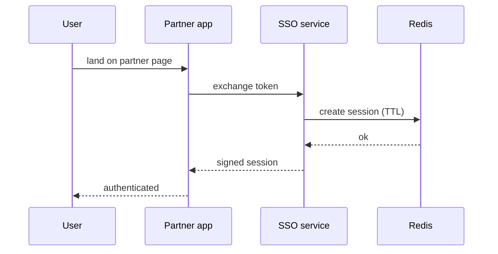

A partner-facing SSO service is the definition of "boring but load-bearing" — if
it blinks, every downstream journey blinks with it. Here's how the one I built at
Bajaj Finserv Health (NestJS, TypeScript, MongoDB, Redis) held **99.99% uptime**.

## Session flow

The trick isn't any single component — it's making every hop **stateless except
Redis**, so any instance can serve any request and a rolling deploy never drops a
session.

More coming — this one's still getting fleshed out.
